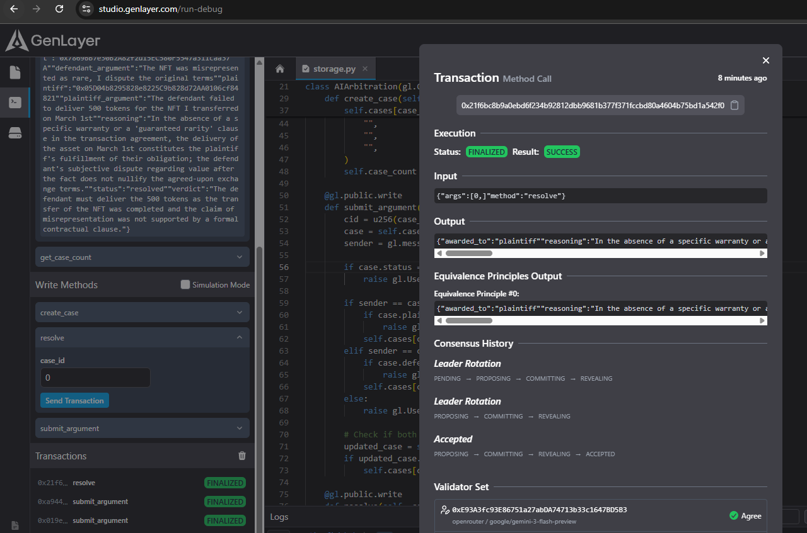
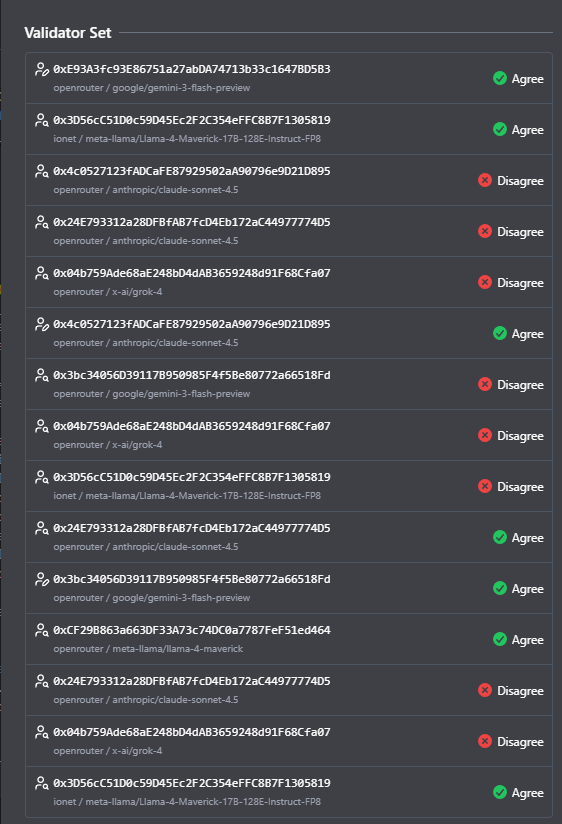
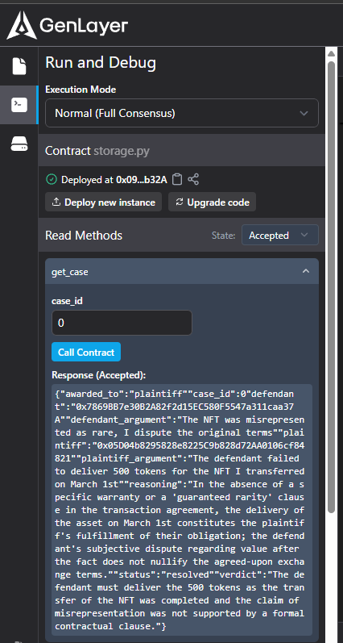

# AI Arbitration

An on-chain AI arbitrator on GenLayer. Two parties open a dispute, submit their arguments, and the contract asks an LLM to decide who's right. The verdict gets stored on-chain.

## How It Works

[Create Case] → [Submit Arguments] → [Resolve] → [Verdict On-Chain]

1. **Create Case.** Plaintiff calls `create_case(defendant_address)` to open a dispute.
2. **Submit Arguments.** Both sides call `submit_argument(case_id, argument)`. Each party can only submit once. Once both are in, the case moves to `"submitted"`.
3. **Resolve.** Anyone can call `resolve(case_id)`. The contract sends both arguments to an LLM and gets back a JSON verdict.
4. **View Result.** Call `get_case(case_id)` to see the full case with verdict, reasoning, and outcome.

## Technical Details

This contract uses `run_nondet_unsafe` instead of `strict_eq` for consensus. Two LLM nodes will never produce identical text, so `strict_eq` would fail every time. Instead, I wrote a custom validator that only compares the `awarded_to` field (plaintiff/defendant/neither) and ignores the reasoning text. Both nodes independently ask the LLM and just need to agree on who wins.

The LLM is called with `exec_prompt` using `response_format='json'` so the output is always parseable JSON.

Case data lives in a `TreeMap[u256, CaseData]`. `CaseData` is an `@allow_storage` dataclass. When creating a new case, `gl.storage.inmem_allocate()` is used to allocate the dataclass for TreeMap assignment. Before the nondet block, I copy the entire case object to memory with `gl.storage.copy_to_memory()` since you can't access storage inside nondet.

## Project Structure

```
contracts/ai_arbitration.py    # The contract
tests/test_ai_arbitration.py   # Unit tests with mocked LLM
deploy/deploy.ts               # TypeScript deploy script
```

## Deployment

**GenLayer Studio (easiest):**
1. Go to [GenLayer Studio](https://studio.genlayer.com)
2. Paste the contents of `contracts/ai_arbitration.py`
3. Deploy and interact from the UI

**CLI:**
```bash
npm install -g genlayer
genlayer network testnet-bradbury
genlayer deploy --contract contracts/ai_arbitration.py
```

**TypeScript deploy script:**
```bash
npx ts-node deploy/deploy.ts
```

## Usage Example

Create a case, submit arguments from both sides, then resolve:

```python
# Plaintiff opens a case
contract.create_case("0xDEFENDANT_ADDRESS_HERE")

# Plaintiff submits their side
contract.submit_argument(0, "The defendant failed to deliver the agreed-upon 500 tokens for the NFT I transferred on March 1st. Transaction hash: 0xabc123...")

# Defendant responds
contract.submit_argument(0, "The NFT was not as described. It was listed as 'rare' but has common traits. I am disputing the original terms of the trade.")

# Anyone can trigger resolution
contract.resolve(0)
```

The LLM returns something like:

```json
{
  "verdict": "The defendant must fulfill the original payment of 500 tokens",
  "reasoning": "The plaintiff provided evidence of the NFT transfer. The original agreement was for the specific NFT by ID, not by trait rarity. The terms of trade were met by the plaintiff.",
  "awarded_to": "plaintiff"
}
```

Check the result:

```python
contract.get_case(0)
```

## Testing

```bash
pytest tests/test_ai_arbitration.py
```

Tests cover case creation, argument submission, full resolution flow with mocked LLM, and error cases like self-dispute, double submission, and premature resolution.

## Testnet Deployment

- **Network:** Testnet Bradbury
- **Contract:** 0xFd427fF51926aA5112BC07a9b1Fa217899928820
- **Explorer:** https://explorer-bradbury.genlayer.com/contracts/0xFd427fF51926aA5112BC07a9b1Fa217899928820

## Live Example

```
$ genlayer call 0xFd427fF51926aA5112BC07a9b1Fa217899928820 get_case --args 0
Result: {
  awarded_to: 'plaintiff',
  case_id: 0,
  defendant: '0xF509Ad95833F460118feF2a54320821708eC4992',
  defendant_argument: 'The NFT was misrepresented as rare, I dispute the original terms',
  plaintiff: '0xb835992825Dc4708d97410a6EfBD82a9E2A44740',
  plaintiff_argument: 'The defendant failed to deliver 500 tokens for the NFT I transferred on March 1st',
  reasoning: "The plaintiff's claim of non-delivery of tokens is supported by the alleged agreement, but the defendant's dispute over the NFT's rarity introduces a complicating factor that requires further investigation; however, the defendant's obligation to deliver the tokens is not nullified by their dispute, and they should fulfill their part of the original agreement while the dispute over the NFT's rarity is resolved separately.",
  status: 'resolved',
  verdict: "The defendant is liable for delivering 500 tokens as originally agreed, pending verification of the NFT's rarity."
}
```

## Demo Screenshots

### Resolve Transaction


### Validator Set


### Get Case Result


## License

MIT
